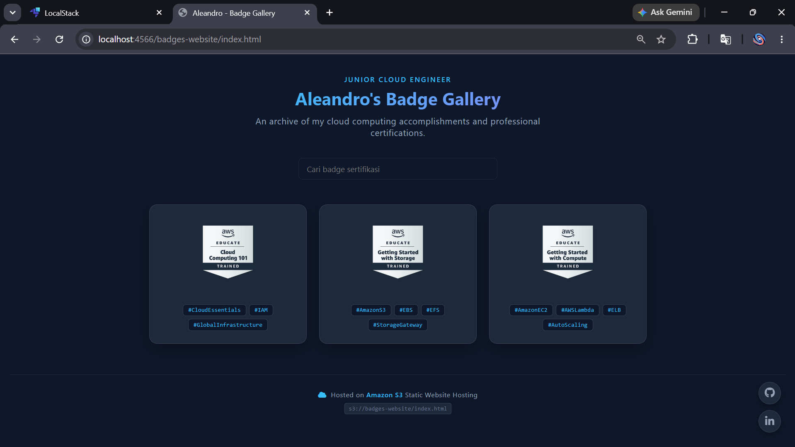
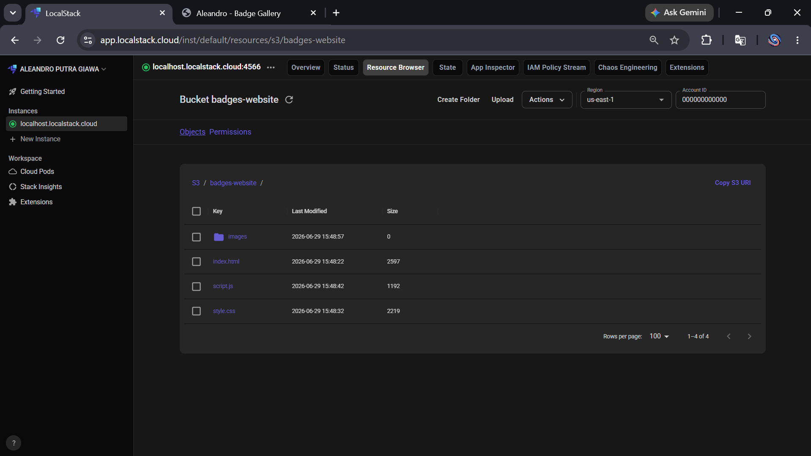

## 🚀 Project Showcase: Cloud Certification Gallery Board

**📅 Date:** June 27, 2026
**🛠️ Tech Stack:** HTML5, CSS3, AWS S3 Static Website Hosting, LocalStack Docker

---

### 📌 Project Overview
Developed a minimal, dark-themed static portfolio website designed to showcase professional cloud certification badges. The architecture was completely refactored from standard Credly iframes into a responsive **Grid Gallery** to achieve instantaneous page load times.

The static files are deployed directly to the root of an Amazon S3 bucket with a clean directory structure:
* 📄 `index.html` - Main application structure and validation hyperlink integrations.
* 🎨 `style.css` - Layout management, component styling, and visual tokens.
* 📁 `images/` - Dedicated directory for locally hosted high-resolution badge assets.

Each badge component is fully dynamic and securely routes users to its respective public Credly verification page upon interaction.

### 🔐 Security & Operations Note
* Engineered access controls using an **AWS S3 Bucket Policy** (`policy.json`) to enforce explicit anti-delete protection, safeguarding the core site files and all assets inside the `images/` directory.
* Conducted the entire deployment lifecycle, object management pipeline, and integration testing locally utilizing the **LocalStack** ecosystem to simulate a real AWS environment without incurring cloud costs.

