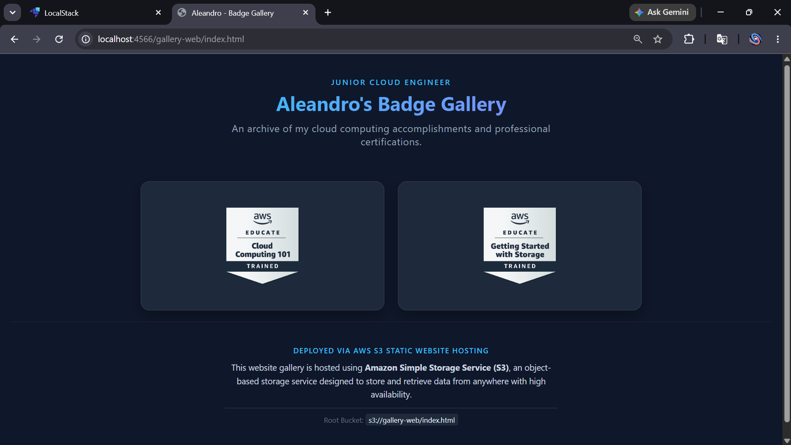
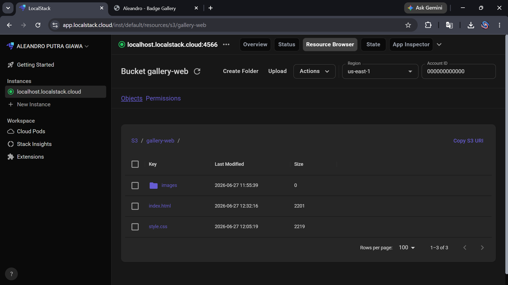

## 🚀 Project Showcase: Cloud Certification Gallery Board

**📅 Date:** 2026-06-27
**🛠️ Tech Stack:** HTML5, CSS3, AWS S3 Static Website Hosting, LocalStack Docker

---

### 📌 Project Overview
Bikin web portofolio statis dengan tema *Dark Mode* untuk pameran badge sertifikasi profesional. Desain dirombak total dari iframe Credly menjadi **Grid Gallery** responsif agar loading instan. 

Arsitektur penyimpanan file diunggah langsung ke root bucket S3 dengan struktur yang bersih:
* 📄 `index.html` - Struktur utama web & integrasi link kredensial.
* 🎨 `style.css` - Manajemen tata letak komponen visual.
* 📁 `images/` - Folder penyimpanan khusus aset gambar badge lokal.

Setiap kartu badge di dalamnya sudah dinamis dan terhubung ke link validasi publik Credly jika diklik.

### 🔐 Security & Operations Note
* Eksperimen pengamanan aset bucket via **AWS S3 Bucket Policy** (`policy.json`) untuk proteksi *anti-delete* terhadap file utama dan seluruh isi di dalam folder `images/`.
* Deployment, manajemen objek, dan testing dilakukan secara lokal menggunakan ekosistem **LocalStack**.

